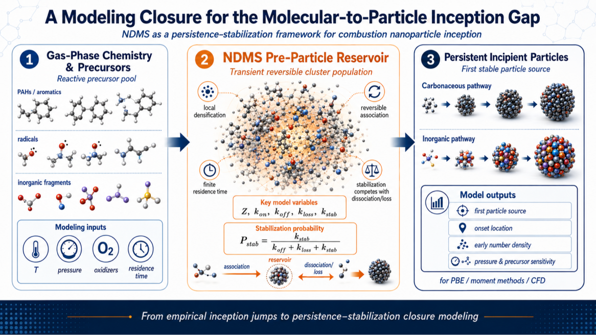

# NDMS Nanoparticle Inception

**Transient Nano-Dense Molecular State (NDMS) Hypothesis and Persistence–Stabilization Closure for Combustion Nanoparticle Inception**

This repository provides companion materials for scientific work on nanoparticle inception in combustion systems, with emphasis on the transient nano-dense molecular state (NDMS) hypothesis and its formulation as a persistence–stabilization closure.

The purpose of this repository is to support transparent scientific communication, reproducible model demonstration, and further development of physically interpretable inception closures for soot and selected inorganic flame-aerosol systems.

## Conceptual Overview



The NDMS framework introduces a structured modeling closure between gas-phase chemistry and persistent incipient particles. Instead of treating nanoparticle inception as a direct empirical jump from molecular precursors to particles, the framework separates the process into precursor association, transient reversible clustering, dissociation/loss, and chemical or structural stabilization.

## Scientific Context

Nanoparticle inception remains one of the least constrained steps in predictive combustion particle modeling. Detailed gas-phase chemistry can describe fuel decomposition, aromatic growth, PAH chemistry, radical pathways, oxidation, surface growth, and coagulation, but the transition from molecular precursors to the first persistent particles often still requires empirical or semi-empirical closure.

The NDMS framework addresses this gap by treating nanoparticle inception as a competition between:

* reversible local precursor association,
* transient cluster formation,
* dissociation and non-stabilizing losses,
* chemical or structural stabilization,
* formation of persistent incipient particles.

In this view, transient molecular clustering alone is not sufficient for particle inception. Persistent particles appear only when stabilization competes successfully with dissociation and other losses.

## Core Concept

The transient nano-dense molecular state is defined as a transient, non-equilibrium, locally dense ensemble of associated molecular or sub-molecular precursor units.

It is not treated as a new equilibrium thermodynamic phase. It is used as a scale-local modeling descriptor for enhanced precursor encounter density, finite residence time, reversible association, and conditional transition toward stable particle formation.

## Companion Papers

This repository is connected to the following public scientific works:

1. **Nanoparticle Inception via a Transient Nano-Dense Molecular State: Bridging Clustering and Chemical Stabilization**
   Zenodo, March 2026
   DOI: 10.5281/zenodo.19730735

2. **Transient Nano-Dense Molecular States as a Persistence–Stabilization Closure for Combustion Nanoparticle Inception**
   Zenodo, May 2026
   DOI: 10.5281/zenodo.20258147

## Repository Content

* `papers/`
  Public paper PDFs and citation information.

* `docs/`
  Scientific summaries, terminology notes, and model-equation explanations.

* `notebooks/`
  Reproducible Jupyter notebooks demonstrating simplified NDMS model behavior.

* `scripts/`
  Python scripts implementing reduced NDMS model equations.

* `data/`
  Synthetic or illustrative demonstration data only.

* `figures/`
  Public or recreated figures used for explanation and communication.

## Repository Map

This repository currently contains:

* `papers/`
  Companion papers introducing and developing the NDMS hypothesis and persistence–stabilization closure.

* `docs/scientific-summary.md`
  A concise scientific summary of the transient nano-dense molecular state concept.

* `docs/model-equations.md`
  A reduced mathematical summary of the NDMS persistence–stabilization closure.

* `docs/how-to-use.md`
  Instructions for running the current zero-dimensional model demonstration.

* `scripts/ndms_zero_dimensional_model.py`
  A simple executable Python model showing how dissociation, loss, and stabilization affect the bounded stabilization probability and NDMS inception source.

## First Executable Demonstration

The current Python script demonstrates the reduced zero-dimensional NDMS closure:

```text
P_stab = k_stab / (k_off + k_loss + k_stab)

S_NDMS = k_stab * k_on * C_assoc^m / (k_off + k_loss + k_stab)
```

To run it:

```bash
python scripts/ndms_zero_dimensional_model.py
```

This first demonstration shows that transient clustering alone is not sufficient for nanoparticle inception. Persistent particle formation depends on whether stabilization competes successfully with dissociation and other non-stabilizing losses.  

## Planned Demonstrations

The initial computational demonstrations will focus on:

* zero-dimensional persistence–stabilization behavior,
* influence of dissociation, loss, and stabilization rates,
* bounded stabilization probability,
* sensitivity of incipient-particle source terms,
* comparison between direct empirical nucleation and structured NDMS closure.

## Licensing

The scientific papers and documentation are shared under Creative Commons Attribution 4.0 International License (CC BY 4.0), unless otherwise stated.

Code examples, scripts, and notebooks are shared under the MIT License, unless otherwise stated.

## Author

**Ahmad Saylam**
Independent Researcher – Applied Physical and Chemical Sciences
Duisburg, Germany
Email: [saylamah@gmail.com](mailto:saylamah@gmail.com)

## Keywords

nanoparticle inception, soot, combustion, flame aerosol synthesis, transient nano-dense molecular state, NDMS, persistence-stabilization, PAH clustering, chemical kinetics, population balance, nucleation closure, thermochemical processes

## Companion Papers

This repository currently includes two companion papers on the transient nano-dense molecular state (NDMS) concept for nanoparticle inception in combustion systems.

### 1. Nanoparticle Inception via a Transient Nano-Dense Molecular State: Bridging Clustering and Chemical Stabilization

**Zenodo, March 2026**
**DOI:** 10.5281/zenodo.19730735

This paper introduces the NDMS hypothesis as a physically grounded and testable interpretation of nanoparticle inception. It proposes that particle formation can proceed through a transient, non-equilibrium, locally dense molecular state that bridges physical clustering and chemical stabilization.

Repository file:
[Nano-CondensedPhaseTransition_up_45.pdf](./Nano-CondensedPhaseTransition_up_45.pdf)

### 2. Transient Nano-Dense Molecular States as a Persistence–Stabilization Closure for Combustion Nanoparticle Inception

**Zenodo, May 2026**
**DOI:** 10.5281/zenodo.20258147

This paper develops the NDMS concept into a practical modeling framework. It separates precursor association, cluster dissociation, non-stabilizing loss, and stabilization into distinct model components and proposes a persistence–stabilization closure for soot and selected inorganic nanoparticle-inception systems.

Repository file:
[Modeling_Framework_33.pdf](./Modeling_Framework_33.pdf)

## Scientific Development Path

The repository will be developed step by step. Planned additions include:

* a concise scientific summary of the NDMS hypothesis,
* a mathematical summary of the persistence–stabilization closure,
* a zero-dimensional demonstration model,
* Python scripts and Jupyter notebooks,
* illustrative parameter-sensitivity examples,
* figures and educational material for scientific communication.

## Important Note

The materials in this repository are intended for open scientific communication, reproducibility, and conceptual model development. They do not contain confidential industrial data or proprietary project information.

