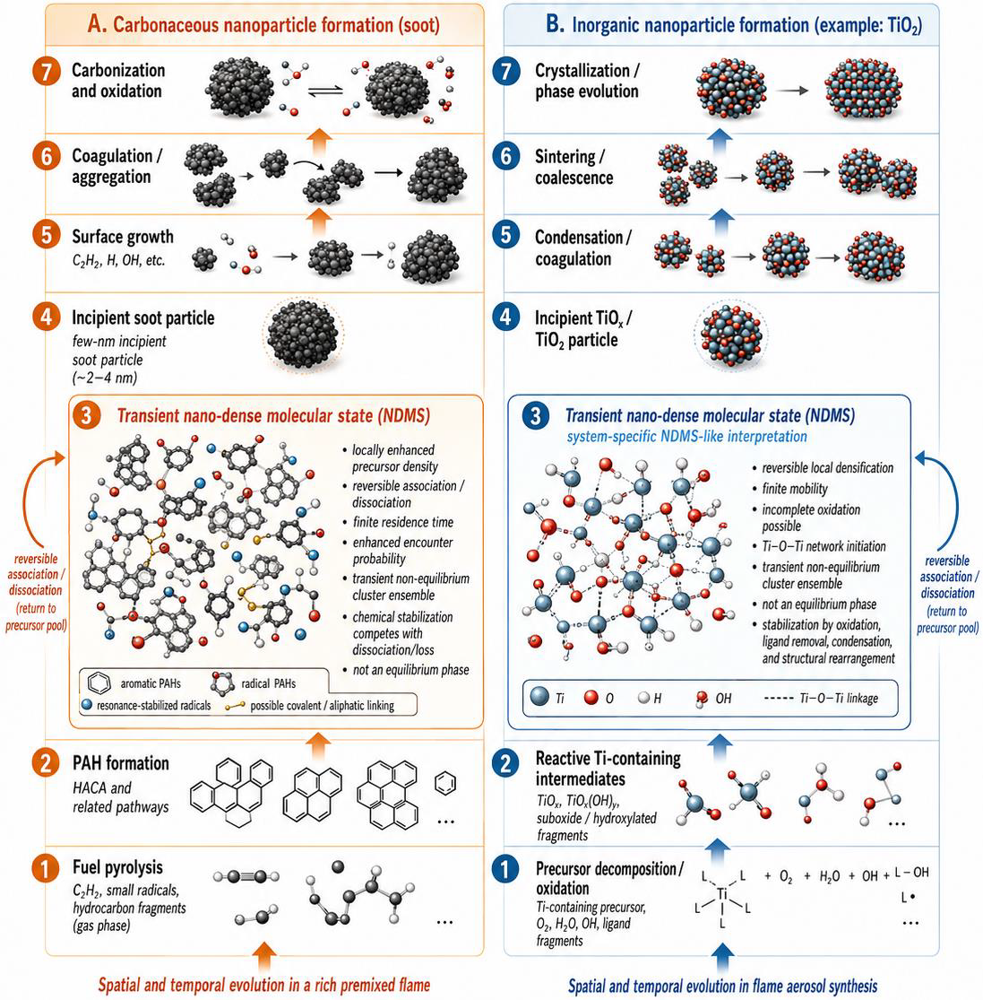

# Scientific Summary

## Transient Nano-Dense Molecular State (NDMS) Hypothesis

This repository introduces and develops the concept of a **transient nano-dense molecular state (NDMS)** as a physically interpretable framework for nanoparticle inception in combustion systems.

Nanoparticle inception is one of the least constrained stages in combustion particle modeling. Detailed gas-phase chemistry can describe fuel decomposition, aromatic growth, PAH chemistry, radical pathways, oxidation, surface growth, and coagulation. However, the transition from molecular precursors to the first persistent particles is often still represented by empirical nucleation rates, selected dimerization reactions, or source terms into a first particle bin.

The NDMS framework addresses this gap by separating the early inception process into distinct physical and chemical steps:

1. Formation of molecular or sub-molecular precursor species.
2. Reversible local association and transient clustering.
3. Development of a locally dense, non-equilibrium precursor environment.
4. Competition between dissociation, non-stabilizing losses, and stabilization.
5. Formation of persistent incipient particles only when stabilization becomes effective.

## Core Idea

The NDMS is not proposed as a new equilibrium thermodynamic phase.

It is defined as a **transient, non-equilibrium, locally dense ensemble of associated molecular or sub-molecular precursor units**. This ensemble remains reversible on the dissociation timescale and becomes relevant to particle inception only when chemical or structural stabilization competes successfully with dissociation and other losses.

In simple terms:

**Transient clustering alone is not particle inception. Persistent particles appear only when stabilization wins over dissociation and loss.**

## Physical Meaning

The NDMS concept provides a bridge between two common descriptions of nanoparticle inception:

* physically driven clustering,
* chemically driven stabilization.

For soot formation, this may involve PAH association, radical-driven reactions, covalent linking, hydrogen loss, aromatization, carbonization, and chemical aging.

For selected inorganic flame-aerosol systems, the corresponding processes may involve precursor decomposition, oxidation, hydrolysis, ligand removal, oxygen incorporation, structural rearrangement, and crystallization.

The specific chemistry is system-dependent, but the modeling structure is general: reversible precursor association competes with stabilization.

## Conceptual Pathways for Carbonaceous and Inorganic Nanoparticle Formation

**Figure:** Conceptual comparison of carbonaceous nanoparticle formation, represented by soot, and inorganic nanoparticle formation, represented by TiO₂ flame-aerosol synthesis. In both cases, the NDMS region is interpreted as a transient, non-equilibrium, locally dense precursor ensemble. The specific chemistry is system-dependent, but the modeling structure emphasizes reversible association, finite residence time, and stabilization-controlled transition to persistent particles.

## Persistence–Stabilization Closure

The persistence–stabilization closure separates:

* precursor association,
* transient cluster formation,
* cluster dissociation,
* non-stabilizing loss,
* chemical or structural stabilization,
* formation of persistent incipient particles.

This separation avoids treating nanoparticle inception as an instantaneous molecular-to-particle jump.

A central quantity is the competition between stabilization and loss. When stabilization is slow compared with dissociation and other losses, transient clusters disappear before forming persistent particles. When stabilization becomes comparable to or faster than the loss processes, particle inception becomes more likely.

## Purpose of This Repository

This repository is intended to provide:

* public companion materials for the NDMS papers,
* concise scientific explanations,
* simplified mathematical summaries,
* reproducible demonstration models,
* Python scripts and Jupyter notebooks,
* educational figures and technical notes.

The repository is designed for scientific communication, transparent model development, and future reproducible demonstrations.

No confidential industrial data, proprietary project data, or restricted information is included.
